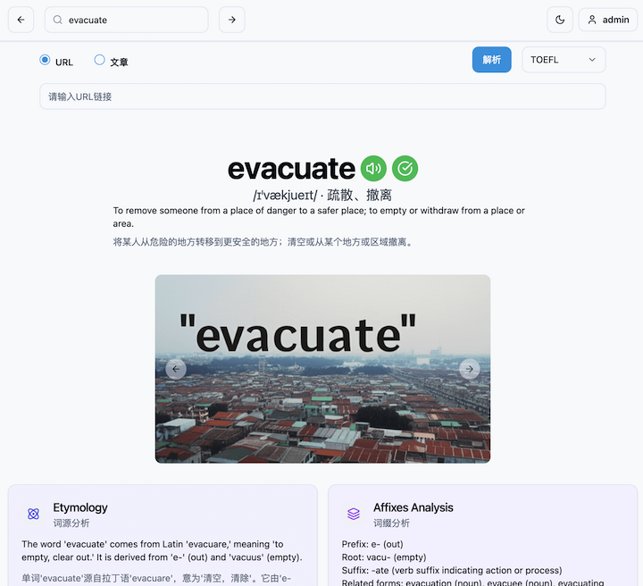

<p align="center">
  <a href="https://github.com/glovebx/wordbento-lovable">
    
  </a>
</p>

# WordBento - Cloudflare D1 KV R2 Full Stack Application for Learning English

这是一个Bento Grid形式学习英文单词的React App。  
The project is split into a **server** (Cloudflare Workers) and a **client** (React with Vite). It provides a complete setup for managing users, tokens, and a database with Drizzle ORM.

---

## Features

- **Cloudflare D1 Database**: Local and production database support using Drizzle ORM.
- **Authentication**: Cookie-based authentication with Cloudflare KV for secure session management.
- **React Frontend**: A modern and fast frontend powered by Vite and Tailwind CSS.
- **Development Workflow**: Monorepo with `pnpm` workspaces for seamless development.
- **Built-in Linting**: ESLint is preconfigured for both client and server.
- **Scalable**: Easily extendable for more features and services.
- **Local Development**: Uses Wrangler for local D1 database、 KV and R2 simulation.

---

## Project Structure

### Monorepo Setup
The repository uses a monorepo structure with `pnpm` workspaces:

- **`client/`**: React-based frontend using Vite and Tailwind CSS.
- **`server/`**: Backend built on Cloudflare Workers with Hono and Drizzle ORM.

### Scripts
The root package includes global scripts:
- **`dev`**: Starts both client and server in development mode.
- **`build`**: Builds both client and server for production.
- **`start`**: Runs the production server.
- **`lint`**: Lints all packages using ESLint.

---

## Setup Instructions

### 1. Install Dependencies

Ensure you have `pnpm` installed. If not, you can install it globally:

```bash
npm install -g pnpm
```

Once installed, run the following command in the project root to install all dependencies for both client and server:

```bash
pnpm install
```

### 2. Create Environment Files

Both the server and client require `.env` files for configuration. Create the following `.env` files:

#### Server `.env`
```env
D1_DATABASE=d1_database_name
CLOUDFLARE_D1_TOKEN=your_d1_token
CLOUDFLARE_DATABASE_ID=your_database_id
CLOUDFLARE_ACCOUNT_ID=your_account_id
NODE_ENV=development
```

#### Client `.env`
```env
VITE_APP_NAME="App"
VITE_APP_API_BASE_URL=http://localhost:8787
```

You can also create `.env.development` and `.env.production` files for environment-specific configurations.

### 3. Update Wrangler Configuration

In `wrangler.toml`, update the following variables:

```toml
account_id = "YOUR-ACCOUNT-ID"

[[d1_databases]]
binding = "DB"
database_name = "wordbento"
database_id = "YOUR-DATABASE-ID"
migrations_dir = "drizzle/migrations"

[[kv_namespaces]]
binding = "SESSION_KV"
id = "YOUR-KV-ID"
preview_id = "YOUR-KV-ID"

[[r2_buckets]]
binding = "WORDBENTO_R2"
bucket_name = "YOUR-R2-BUCKET-NAME"

[vars]
NODE_ENV = "production"
```

Make sure the values align with your `.env` file.

### 4. Add GitHub Repository Secrets

To automate builds on Cloudflare, add the following secrets to your GitHub repository:

- **`CF_API_TOKEN`**: Your Cloudflare API Token.
- **`CF_ACCOUNT_ID`**: Your Cloudflare Account ID.
- **`CF_PROJECT_ID`**: Your Cloudflare Pages project ID (if using Pages).
- **`VITE_APP_NAME`**: Your app's name.
- **`VITE_APP_API_BASE_URL`**: API URL.

#### Steps to Add Secrets
1. Navigate to your GitHub repository.
2. Go to **Settings** > **Secrets and variables** > **Actions**.
3. Add the secrets with the appropriate names and values.

---

## Server Setup

The server is built with Cloudflare Workers and uses the following stack:
- **Hono**: Lightweight web framework for Cloudflare Workers.
- **Drizzle ORM**: Modern and type-safe ORM for database management.
- **Cookie-Based Authentication**: Secure authentication using cookies and Cloudflare KV for session storage.

### Key Features
- **Database Management**: Use Drizzle ORM to generate and push migrations.
- **Cloudflare D1**: Fully compatible with D1 for local and live databases.
- **Environment Variables**: Configuration for production and local development.

### Important Scripts
- **`dev`**: Starts Wrangler for development and Drizzle Studio.
- **`generate:migration`**: Generates a new migration file.
- **`push:migration`**: Pushes migrations to the local D1 database.

### Database Initialization

Run the following to create a local database and apply schema:

```bash
npx wrangler d1 execute wordbento --env development --file=schema.sql
```

To create the database schema in the remote D1 environment, run:

```bash
npx wrangler d1 execute wordbento --env production --file=schema.sql --remote
```

---

## Development Workflow

### Start Development

Run the following command to start both the client and server in development mode:

```bash
pnpm dev
```

### Build for Production

To build the client and server:

```bash
pnpm build
```

### Deploy

To deploy the project to Cloudflare Workers:

```bash
pnpm deploy
```

## Thank You for Your Support

As an independent developer, your support means the world to me. Every piece of feedback, download, and kind word helps me continue creating unique projects like this one. Thank you for being a part of this journey and making it possible to bring my ideas to life.